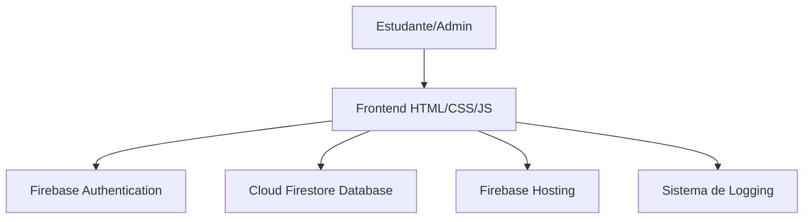

# Arquitetura do Sistema - Career Guidance

## 1. Diagrama de Arquitetura
O sistema segue uma arquitetura **Serverless** baseada na plataforma Firebase.

## 2. Componentes Principais

| Componente | Tecnologia | Responsabilidade |
| :--- | :--- | :--- |
| **Frontend** | HTML5, CSS3, JS | Interface do usuário e lógica de navegação. |
| **Autenticação** | Firebase Auth | Gerenciamento de sessões e segurança de acesso. |
| **Banco de Dados** | Cloud Firestore | Armazenamento NoSQL de faculdades, usuários e logs. |
| **Hospedagem** | Firebase Hosting | Entrega global de arquivos estáticos com SSL. |
| **Lógica de Negócio** | JavaScript Client-side | Validação de elegibilidade e cálculo de score do teste. |

## 3. Decisões de Design
- **Modularidade**: O código é dividido em páginas HTML independentes com scripts específicos, facilitando a manutenção.
- **Escalabilidade**: O uso de Firebase permite que o sistema suporte milhares de usuários simultâneos sem necessidade de gerenciar servidores.
- **Segurança**: Implementação de regras de segurança no nível do banco de dados (Firestore Rules).
